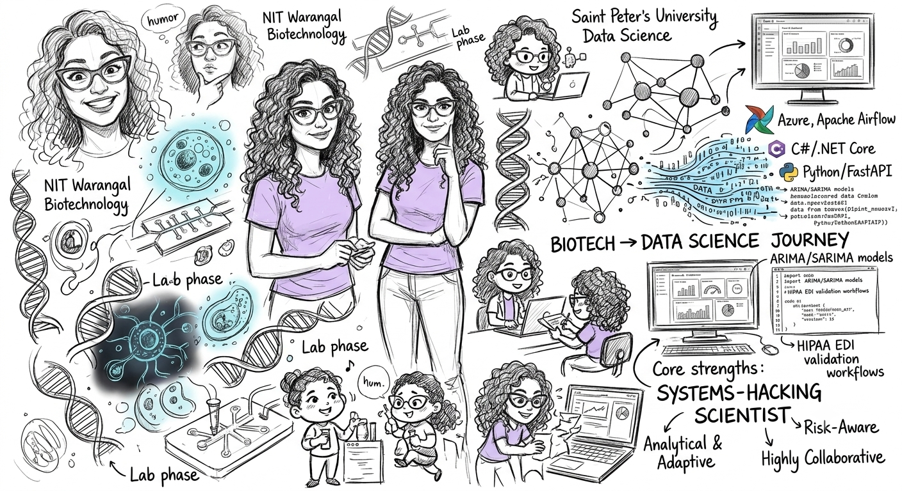

  

# Hi there! I'm Manasa 👋
## 🧬 Systems-Hacking Scientist | IT Infrastructure & Data Pipelines

I am an IT professional with hands-on experience spanning backend microservices, cloud operations, and data pipeline orchestration across regulated healthcare and life sciences environment. I specialize in bridging the gap between biological insights and complex data infrastructure.

### 🛠️ Technical Toolkit

*   **Cloud & Infrastructure:** Azure (AZ-900), Red Hat Linux, Docker, CI/CD, Apache Airflow
*   **Software Development:** Python (FastAPI), C#/.NET Core (Entity Framework), SQL Server, PostgreSQL
*   **Data & Compliance:** HIPAA EDI 270/271/277, CMS Compliance, Power BI, ETL Frameworks
*   **Analytics & Modeling:** ARIMA/SARIMA Time-Series Forecasting, Scikit-Learn, Statistical Modeling

### 🚀 Featured Highlights & Impact

*   **Backend & Cloud Reliability:** Maintained 27-32 Python/FastAPI microservices on Azure/Linux, sustaining 99%+ uptime for core workflows.
*   **Data Orchestration:** Engineered Apache Airflow ETL pipelines and reduced pipeline failure response times by 40%.
*   **Regulated Compliance:** Designed data validation workflows ensuring strict HIPAA and CMS compliance for healthcare data processing.

---
📫 **How to reach me:** c.manasa289@gmail.com | Downingtown, PA
